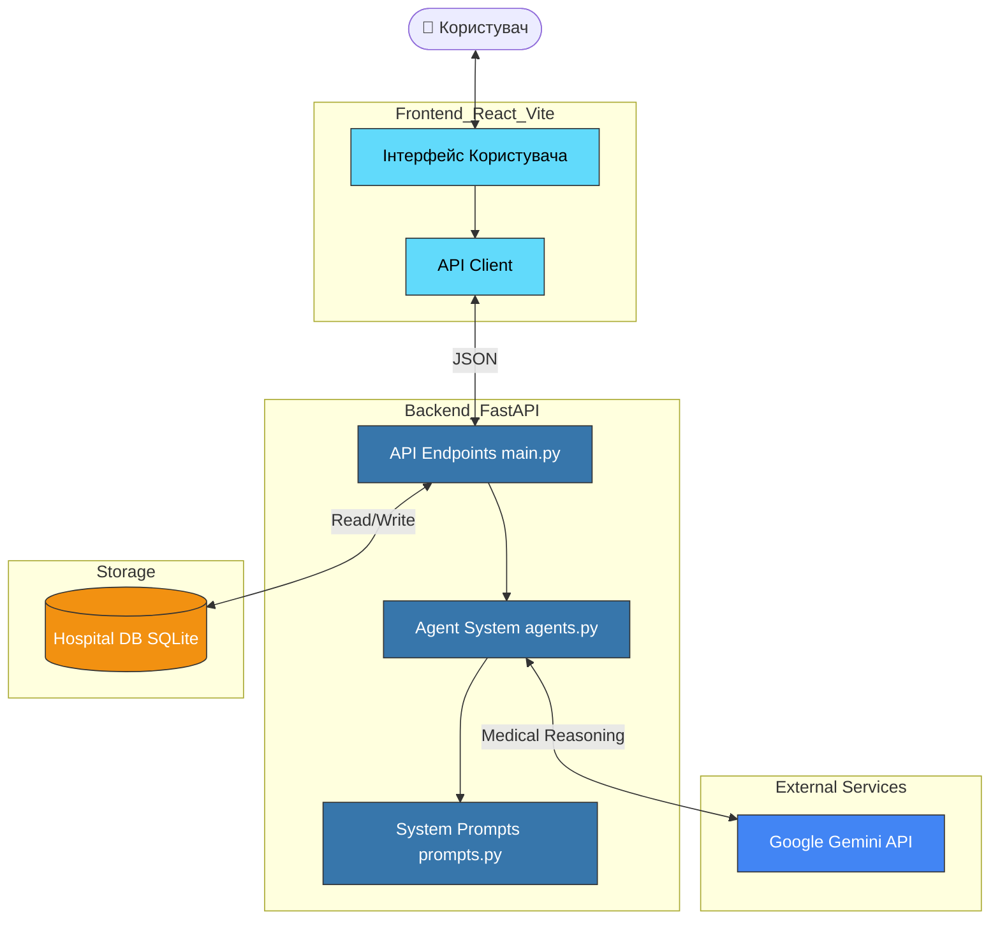
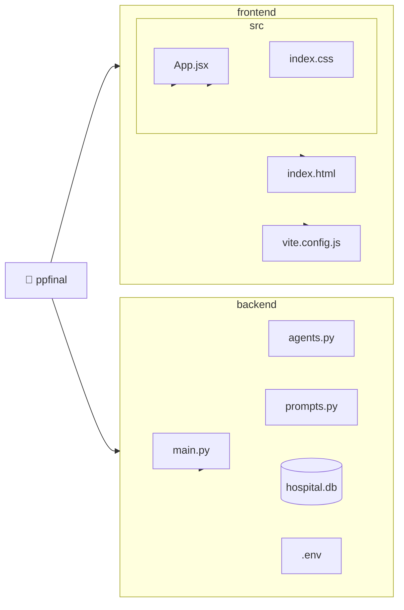

# Структура Проєкту MedCouncil AI

Ось оновлена візуалізація архітектури та структури файлів з виправленим синтаксисом.

## Архітектурна Схема (Component View)

```mermaid
flowchart TD
    %% Nodes
    User([👤 Користувач])
    
    subgraph Frontend [Frontend_React_Vite]
        direction TB
        UI[Інтерфейс Користувача]
        API_Client[API Client]
    end
    
    subgraph Backend [Backend_FastAPI]
        direction TB
        API[API Endpoints main.py]
        AgentSystem[Agent System agents.py]
        Prompts[System Prompts prompts.py]
    end
    
    subgraph Data [Storage]
        DB[(Hospital DB SQLite)]
    end
    
    subgraph External [External Services]
        Gemini[Google Gemini API]
    end

    %% Edge Connections
    User <--> UI
    UI --> API_Client
    API_Client <-->|JSON| API
    
    API --> AgentSystem
    AgentSystem --> Prompts
    AgentSystem <-->|Medical Reasoning| Gemini
    
    API <-->|Read/Write| DB
    
    %% Styling
    classDef react fill:#61dafb,stroke:#333,color:black;
    classDef python fill:#3776ab,stroke:#333,color:white;
    classDef db fill:#f29111,stroke:#333,color:white;
    classDef google fill:#4285f4,stroke:#333,color:white;
    
    class UI,API_Client react;
    class API,AgentSystem,Prompts python;
    class DB db;
    class Gemini google;
```

## Структура Файлів (File View)

```mermaid
flowchart LR
    Root[📂 ppfinal]
    
    subgraph BE [backend]
        Main[main.py]
        Agents[agents.py]
        Prompts[prompts.py]
        DB_File[(hospital.db)]
        Env[.env]
    end
    
    subgraph FE [frontend]
        Index[index.html]
        subgraph Src [src]
            App[App.jsx]
            Styles[index.css]
        end
        Configs[vite.config.js]
    end
    
    Root --> BE
    Root --> FE
    
    BE --> Main
    BE --> Agents
    BE --> Prompts
    BE --> DB_File
    BE --> Env
    
    FE --> Src
    FE --> Index
    FE --> Configs
    Src --> App
    Src --> Styles
```
